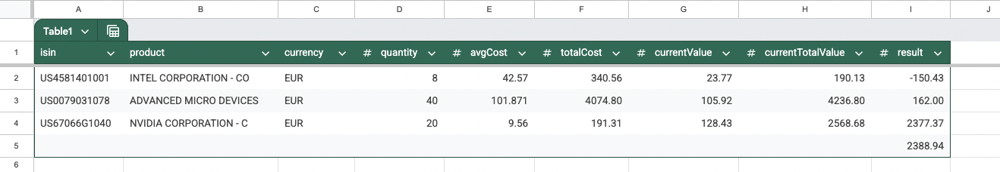

# Halir

Helpers for personal finance management, like...

## Getting CSV (Excel, Google Sheets) with current state of your securities portfolio

from DEGIRO transactions CSV export.



```javascript
import { makeOverviewFromTransactionsEnhancedCsv, lib } from '@halir/framework';

const config = {
	/* your options */
};

const csv = 'your csv';

const overviewCsv = await makeOverviewFromTransactionsEnhancedCsv(lib, 'degiro', config, csv);
```

## Getting normalized data (JSON)

from DEGIRO transactions CSV export.

```javascript
import { csvToHston, lib } from '@halir/framework';

const config = {
	/* your options */
};

const csv = 'your csv';

const hston = await csvToHston(lib, 'degiro', config, csv);
```

Will produce JSON of this shape, see [HSTON](src/main/types.js:90).
